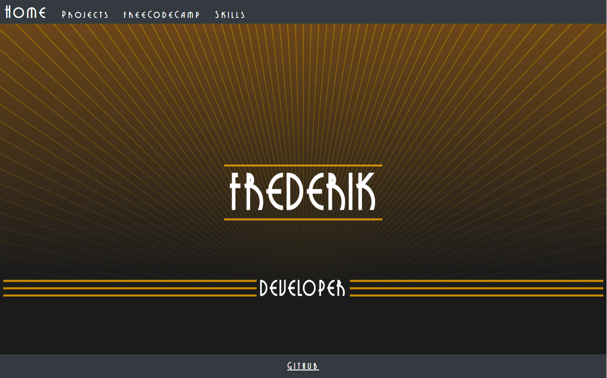
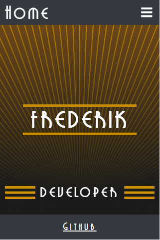
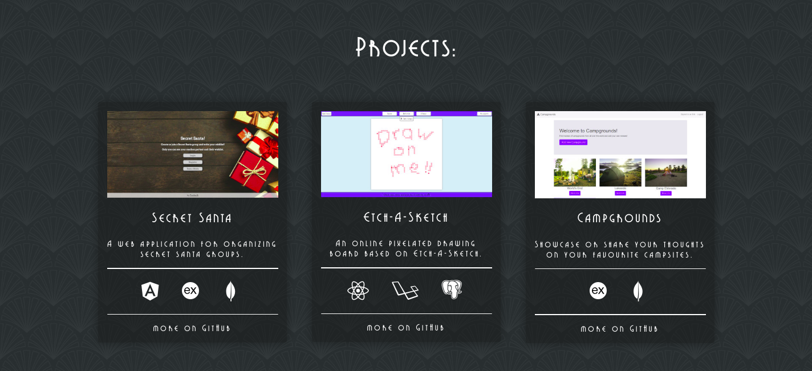
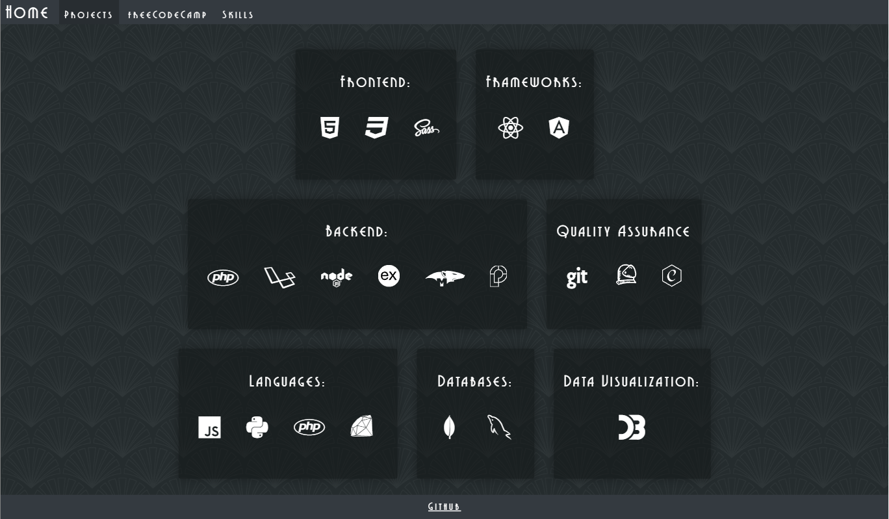

# Portfolio

## Introduction

Hi! My name is Frederik and I'm a web developer!

Check out my personal projects and my submissions for the freeCodeCamp curriculum on my portfolio!

https://myrmidonut.github.io/portfolio

***

## Skills
* Frontend
   * HTML5
   * CSS3
   * Sass

* Frontend Libraries and Frameworks
   * React
   * Angular

* Backend
   * PHP
   * Laravel
   * Node
   * Express
   * Mongoose
   * Passport

* Quality Assurance and Testing
   * git
   * Helmet
   * Chai

* Programming Languages
   * JavaScript
   * PHP
   * Python
   * Ruby

* Databases
   * MongoDB
   * SQL

* Data Visualization
   * D3

***

## Preview Images
### Main

### Mobile

### Projects

## Skills
